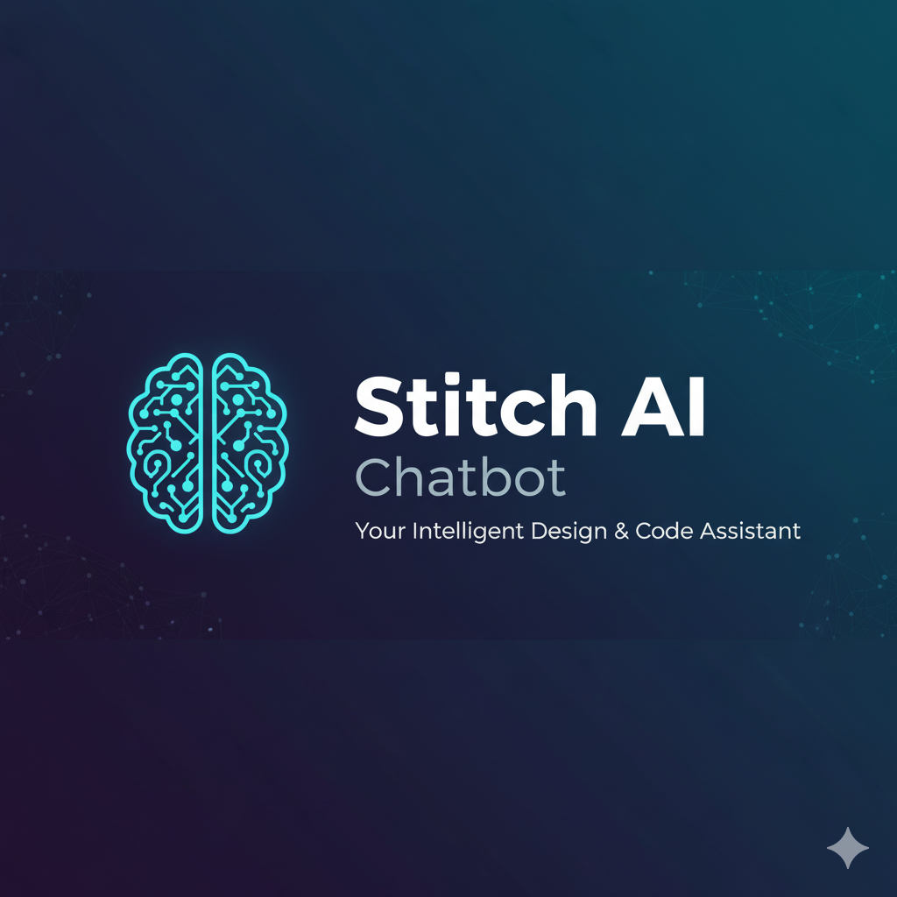

<h2 align="center">🤖 Stitch.AI – Intelligent Chatbot Platform</h2>

  

---

### 🌍 Overview

**Stitch.AI** is a USA-based enterprise chatbot platform designed to assist **IT, HR, and Procurement** departments by providing instant answers and support using a custom **LLM (Large Language Model)**.  
The app is built with a **feature-based architecture** ensuring scalability, modularity, and maintainability.

It supports **Azure AD authentication**, **real-time chat**, and **integration with knowledge bases and live data APIs**.

---

### 🛠️ Tech Stack

| Layer | Technology |
|-------|-------------|
| **Frontend** | Flutter (Dart), Riverpod, GoRouter |
| **Backend Services** | .NET Framework, Azure Functions |
| **Authentication** | Azure AD (Microsoft Authentication Library) |
| **State Management** | Riverpod |
| **API Integration** | Dio |
| **CI/CD & Deployment** | GitHub Actions, Microsoft Intune |
| **IDE** | Visual Studio Code |

---

### ⚙️ Architecture Highlights

- **Feature-based folder structure** for scalability.
- **Riverpod** for state management and reactivity.
- **Dynamic environment configuration** (dev/prod).
- **Azure AD Authentication** for secure user access.
- **Dio API integration layer** with error handling and interceptors.
- **Responsive UI** supporting mobile and tablet layouts.

---

### 💡 Key Features

- 🔐 **Secure Login via Azure AD**
- 💬 **Real-time Chat Interface** powered by LLM
- 🧠 **Context-aware Responses** from IT/HR knowledge base
- 🌐 **Dynamic API Switching** (based on environment)
- 🧩 **Modular Architecture** for easy feature expansion
- 📱 **Responsive UI Design**

---

### 🧑‍💻 Responsibilities

- Designed and implemented the **entire app architecture** following scalable best practices.
- Integrated **Azure AD Authentication** with Microsoft Identity.
- Built and optimized **chat flow and message handling** using Riverpod.
- Created **modular environment-based configuration** for dev and prod.
- Conducted **performance profiling** and **UI responsiveness improvements**.
- Integrated **Dio** for robust and scalable API handling.

---

